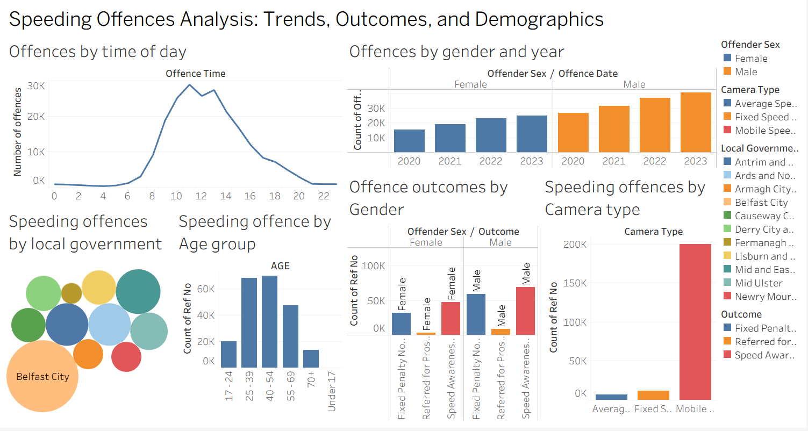

# Northern Ireland Speeding Offences Analysis

An interactive Tableau dashboard analysing speeding offences across Northern Ireland, exploring trends, demographics, camera types, geographical distribution, and offence outcomes.

## Project Overview

This project analyses recorded speeding offences across Northern Ireland using Tableau. The dashboard was designed to explore patterns in speeding offences across different years, times of day, age groups, offender sex, local government districts, camera types, and offence outcomes.

The analysis contains **218,310 recorded offences** and provides multiple views of the data through an interactive Tableau dashboard.

## Project Objectives

* Analyse speeding offences across Northern Ireland.
* Identify patterns in offences by time of day and year.
* Explore speeding offences across different age groups and offender sex.
* Compare offences detected by different camera types.
* Examine the geographical distribution of offences across local government districts.
* Analyse offence outcomes by offender sex.

## Dataset

The dataset was obtained from **data.gov.uk** and contains recorded speeding offences from Northern Ireland.

Key fields include:

* `RefNo` — Unique reference number for each offence
* `OffenceDate` — Date of the speeding offence
* `OffenceTime` — Time of the speeding offence
* `CameraType` — Type of camera that detected the offence
* `SpeedLimit (MPH)` — Speed limit at the location of the offence
* `speed_grouped` — Recorded speed grouped into categories
* `Outcome` — Outcome associated with the offence
* `Local Government District` — District where the offence occurred
* `AGE` — Age group of the offender
* `offender_sex` — Sex of the offender

## Data Preparation

The original dataset contained null and unknown values.

The data preparation process included:

* Removing records with missing speed-limit and grouped-speed values where the number of missing records was relatively small.
* Handling missing local government district values.
* Removing unknown values from the age field.
* Removing unknown values from the offender sex field.
* Using the prepared dataset for the Tableau analysis.

## Dashboard

The Tableau dashboard brings together multiple visualisations to provide an overview of speeding offences across Northern Ireland.

### Dashboard Views

* **Offences by Time of Day** — Shows how offence volumes vary throughout the day.
* **Offences by Gender and Year** — Compares offence counts across offender sex and year.
* **Speeding Offences by Local Government District** — Shows the distribution of offences across Northern Ireland districts.
* **Speeding Offences by Age Group** — Examines offence volumes across different age groups.
* **Offence Outcomes by Gender** — Compares outcomes across offender sex.
* **Speeding Offences by Camera Type** — Compares offences detected by average-speed, fixed-speed, and mobile-speed cameras.

## Key Insights

The dashboard highlights several patterns within the dataset:

* Speeding offences vary considerably throughout the day, with the highest activity occurring around the middle of the day.
* Offence counts increased across the years shown in the gender-by-year comparison.
* The **25–39 and 40–54 age groups** account for a substantial share of recorded offences.
* **Mobile speed cameras** account for the largest number of recorded offences among the camera types shown.
* **Belfast City** has the largest visual representation in the local-government-district analysis.
* Offence outcomes vary between female and male offenders.

## Tools & Technologies

* **Tableau** — Data visualisation and interactive dashboard development
* **CSV** — Source data format

## Repository Contents

* `SPEEDING_OFFENCES_TABLEAU_DASHBOARD.twbx` — Packaged Tableau workbook
* `SPEEDING_OFFENCES_DATASET.zip` — Compressed original dataset
* `Tableau_dashboard.png` — Dashboard preview

## Project Outcome

The completed Tableau dashboard provides an interactive way to explore speeding offences across Northern Ireland and identify patterns relating to time, demographics, geography, camera type, and offence outcomes.
